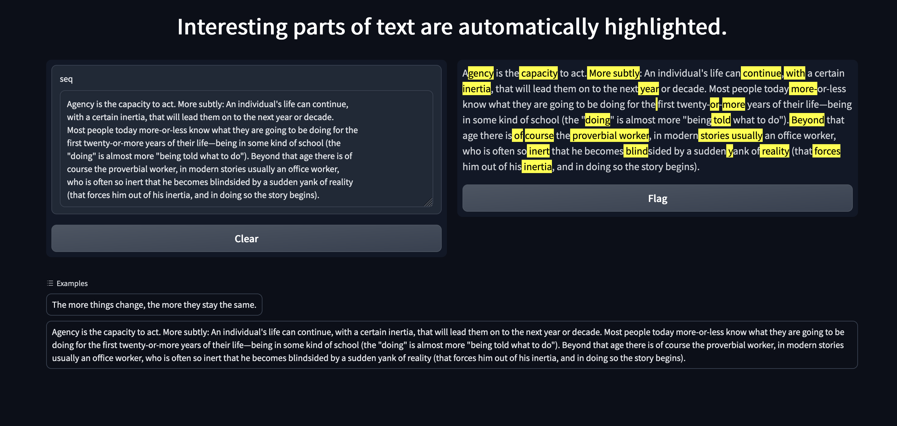

# perplexity

This is a small demo that explores the use of seq2seq 
to highlight interesting parts of texts, where interesting is 
defined as unexpected to `gpt2`. You may launch it with 
```
python perplexity_main.py
```

Here is a picture: 


The dependencies are: transformers, pytorch, numpy and gradio.